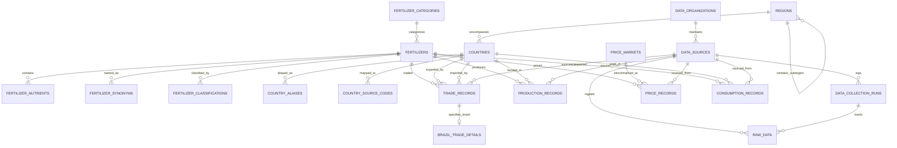

# Modelo de Dados Relacional — FertiPartner (4ª Forma Normal - 4NF)

Este documento descreve a modelagem formal do banco de dados relacional do **FertiPartner** implementado no **Supabase (PostgreSQL)**, atendendo rigorosamente à **Quarta Forma Normal (4NF)** e integrando os requisitos de dados (RD01 a RD08) e as especificações de APIs internacionais e nacionais (FAOSTAT, UN Comtrade, Comex Stat, USDA e World Bank).

Para o histórico e justificativas formais das decisões tomadas, consulte o [ADR-0001](file:///c:/Users/MICRO/Desktop/FertiPartner/docs/architecture/decisions/0001-supabase-4nf-data-architecture.md).

---

## 1. Princípios da 4ª Forma Normal no Domínio

Uma relação está na **4ª Forma Normal (4NF)** se e somente se estiver na Forma Normal de Boyce-Codd (BCNF) e todas as Dependências Multivaloradas (MVDs) não-triviais $X \twoheadrightarrow Y$ forem tais que $X$ é uma superchave da relação.

### Decomposições de MVDs Realizadas:
1. **Composição Nutricional e Sinônimos**: Um fertilizante possui múltiplos teores de nutrientes ($N, P_2O_5, K_2O, S, Ca, Mg$) e múltiplos sinônimos/nomes comerciais. Como esses conjuntos são mutuamente independentes, foram separados em `fertilizer_nutrients` e `fertilizer_synonyms`.
2. **Classificações Tarifárias (HS, NCM, CPC)**: A associação de um fertilizante a códigos alfandegários é multivalorada e independente de seus nomes e nutrientes. É isolada em `fertilizer_classifications`.
3. **Mapeamento de Países por Fonte**: Países possuem aliases em diferentes idiomas e códigos distintos por fonte (FAOSTAT Area Code, UN Comtrade Reporter/Partner numeric code, MDIC CO_PAIS). Separados em `country_aliases` e `country_source_codes`.
4. **Comércio Internacional e Aduana Brasileira**: O comércio exterior geral ocorre entre dois países. As dimensões específicas brasileiras (UF, Modal de Transporte, Recinto Alfandegário URF, Frete e Seguro) são segregadas na tabela de extensão `brazil_trade_details`.
5. **Mercados de Referência de Preço**: O hub de precificação (ex: FOB Golfo dos EUA, FOB Mar Negro, CFR Brasil) é dissociado da série temporal de cotações em `price_markets` e `price_records`.

---

## 2. Diagrama Entidade-Relacionamento (ERD)

---

## 3. Dicionário de Tabelas e Entidades

### 3.1. Núcleo de Fertilizantes e Composição

#### `fertilizer_categories`
Catálogo das macrocategorias agronômicas (Nitrogenados, Fosfatados, Potássicos, NPK Misturas, Micronutrientes).
* `id` (SERIAL / INT, PK)
* `code` (VARCHAR(30), UNIQUE) — Ex: `NITROGENOUS`, `PHOSPHATIC`, `POTASSIC`
* `name` (VARCHAR(100)) — Nome legível em português
* `description` (TEXT)
* `created_at` (TIMESTAMPTZ)

#### `fertilizers`
Entidade central com atributos funcionais monovalorados.
* `id` (SERIAL / INT, PK)
* `slug` (VARCHAR(100), UNIQUE) — Identificador de URL (ex: `ureia`, `map`, `dap`, `cloreto-de-potassio`)
* `canonical_name` (VARCHAR(150), NOT NULL) — Nome oficial canônico
* `category_id` (INT, FK -> fertilizer_categories)
* `cas_rn` (VARCHAR(30)) — Registro no Chemical Abstracts Service (ex: `57-13-6` para Ureia)
* `chemical_formula` (VARCHAR(100)) — Ex: `CO(NH2)2`, `NH4H2PO4`, `KCl`
* `description` (TEXT)
* `is_active` (BOOLEAN, DEFAULT TRUE)
* `created_at` / `updated_at` (TIMESTAMPTZ)

#### `fertilizer_nutrients` (4NF: isola MVD Fertilizante -> Nutrientes)
Teores e garantias nutricionais mínimas, máximas e típicas.
* `fertilizer_id` (INT, PK, FK -> fertilizers)
* `nutrient_code` (VARCHAR(20), PK) — Ex: `N`, `P2O5`, `K2O`, `S`, `CA`, `MG`, `ZN`, `B`
* `percentage_typical` (NUMERIC(5,2)) — Teor padrão (ex: 46.00 para Ureia)
* `percentage_min` (NUMERIC(5,2))
* `percentage_max` (NUMERIC(5,2))
* `is_primary` (BOOLEAN, DEFAULT TRUE)

#### `fertilizer_synonyms` (4NF: isola MVD Fertilizante -> Nomes Comerciais / Traduções)
* `id` (BIGSERIAL, PK)
* `fertilizer_id` (INT, FK -> fertilizers)
* `synonym_name` (VARCHAR(200), NOT NULL) — Ex: "Urea", "Carbamide", "Ureia 46%"
* `language_code` (VARCHAR(10), DEFAULT 'pt') — `pt`, `en`, `es`
* `context` (VARCHAR(50)) — Ex: `commercial`, `scientific`, `raw_source`
* *Constraint*: `UNIQUE(fertilizer_id, synonym_name)`

#### `fertilizer_classifications` (4NF: isola MVD Fertilizante -> Códigos Tarifários)
Mapeamento de códigos alfandegários e estatísticos internacionais.
* `id` (BIGSERIAL, PK)
* `fertilizer_id` (INT, FK -> fertilizers)
* `classification_system` (VARCHAR(30), NOT NULL) — `HS6`, `NCM8`, `CPC`, `CAS`, `FAO_ITEM`
* `classification_code` (VARCHAR(50), NOT NULL) — Ex: `310210` (HS6 Ureia), `31021010` (NCM)
* `description` (TEXT)
* *Constraint*: `UNIQUE(classification_system, classification_code, fertilizer_id)`

---

### 3.2. Geografia e Padronização Espacial

#### `regions`
Hierarquia de continentes e blocos econômicos.
* `id` (SERIAL, PK)
* `code` (VARCHAR(30), UNIQUE) — Ex: `GLOBAL`, `AMERICAS`, `LATAM`, `ASIA_PACIFIC`
* `name` (VARCHAR(100), NOT NULL)
* `parent_region_id` (INT, FK -> regions)
* `created_at` (TIMESTAMPTZ)

#### `countries`
Catálogo unificado de soberanias e territórios (ISO 3166-1).
* `id` (SERIAL, PK)
* `iso2` (CHAR(2), UNIQUE) — Ex: `BR`, `US`, `CN`, `IN`, `RU`, `CA`
* `iso3` (CHAR(3), UNIQUE) — Ex: `BRA`, `USA`, `CHN`, `IND`, `RUS`, `CAN`
* `numeric_code` (INT, UNIQUE) — Código numérico ISO / M49 (ex: 076 para Brasil)
* `name` (VARCHAR(100), NOT NULL) — Nome comum (ex: `Brasil`)
* `official_name` (VARCHAR(200)) — Ex: `República Federativa do Brasil`
* `region_id` (INT, FK -> regions)
* `subregion_id` (INT, FK -> regions)
* `is_active` (BOOLEAN, DEFAULT TRUE)
* `created_at` / `updated_at` (TIMESTAMPTZ)

#### `country_aliases` (4NF: isola MVD País -> Grafias / Aliases)
* `id` (BIGSERIAL, PK)
* `country_id` (INT, FK -> countries)
* `alias_name` (VARCHAR(150), NOT NULL)
* `source_id` (INT, FK -> data_sources, NULLABLE)
* *Constraint*: `UNIQUE(country_id, alias_name)`

#### `country_source_codes` (4NF: isola MVD País -> Códigos de APIs)
Resolve chaves de país proprietárias de cada API pública externa.
* `id` (BIGSERIAL, PK)
* `source_id` (INT, FK -> data_sources)
* `external_code` (VARCHAR(50), NOT NULL) — Ex: `21` na FAOSTAT para Brasil, `105` no Comex Stat
* `country_id` (INT, FK -> countries)
* `external_name` (VARCHAR(150))
* *Constraint*: `UNIQUE(source_id, external_code)`

---

### 3.3. Unidades de Medida e Câmbio

#### `currencies`
* `code` (CHAR(3), PK) — `USD`, `BRL`, `EUR`, `CNY`
* `name` (VARCHAR(50))
* `symbol` (VARCHAR(10))
* `is_active` (BOOLEAN, DEFAULT TRUE)

#### `measurement_units`
* `code` (VARCHAR(20), PK) — `MT` (tonelada métrica), `KG`, `SHORT_TON`, `LITER`
* `name` (VARCHAR(50))
* `unit_type` (VARCHAR(20)) — `MASS`, `VOLUME`
* `to_metric_tons_factor` (NUMERIC(14,8)) — Fator para normalizar em Toneladas Métricas
* `is_standard_unit` (BOOLEAN)

---

### 3.4. Rastreabilidade, Camada Raw e Governança de Coleta

#### `data_organizations`
* `id` (SERIAL, PK)
* `acronym` (VARCHAR(30), UNIQUE) — Ex: `FAO`, `UN`, `MDIC`, `USDA`, `WORLD_BANK`, `FRED`
* `name` (VARCHAR(150), NOT NULL)
* `website_url` (VARCHAR(255))
* `created_at` (TIMESTAMPTZ)

#### `data_sources`
* `id` (SERIAL, PK)
* `organization_id` (INT, FK -> data_organizations)
* `code` (VARCHAR(50), UNIQUE) — Ex: `FAOSTAT_RFN`, `UN_COMTRADE`, `COMEXSTAT_IMP`, `WB_COMMODITY`
* `name` (VARCHAR(150), NOT NULL)
* `api_docs_url` (VARCHAR(255))
* `base_url` (VARCHAR(255))
* `update_frequency` (VARCHAR(30)) — `DAILY`, `WEEKLY`, `MONTHLY`, `ANNUAL`
* `is_active` (BOOLEAN, DEFAULT TRUE)
* `created_at` (TIMESTAMPTZ)

#### `data_collection_runs` (RF19)
Histórico de auditoria de cada pipeline executado.
* `id` (UUID, PK, DEFAULT gen_random_uuid())
* `source_id` (INT, FK -> data_sources)
* `trigger_type` (VARCHAR(30)) — `AUTOMATIC`, `MANUAL`, `SCHEDULED`
* `started_at` / `finished_at` (TIMESTAMPTZ)
* `status` (VARCHAR(20)) — `RUNNING`, `SUCCESS`, `PARTIAL`, `FAILED`
* `records_fetched` (INT)
* `records_inserted` (INT)
* `error_message` (TEXT)
* `metadata` (JSONB)

#### `raw_data` (RD08, RF20)
Repositório imutável de payloads recebidos das APIs.
* `id` (BIGSERIAL, PK)
* `source_id` (INT, FK -> data_sources)
* `collection_run_id` (UUID, FK -> data_collection_runs, NULLABLE)
* `collected_at` (TIMESTAMPTZ, NOT NULL)
* `reference_date` (DATE) — Período a que o dado se refere
* `endpoint_url` (TEXT)
* `payload_hash` (CHAR(64)) — Hash SHA-256 para desduplicação
* `raw_payload` (JSONB, NOT NULL)
* `status` (VARCHAR(30), DEFAULT 'RAW') — `RAW`, `VALIDATED`, `PROCESSED`, `FAILED`

---

### 3.5. Tabelas de Fatos em 4NF (Dados Operacionais e Históricos)

#### `production_records` (RD03, RF03)
* `id` (BIGSERIAL, PK)
* `fertilizer_id` (INT, NOT NULL, FK -> fertilizers)
* `country_id` (INT, NOT NULL, FK -> countries)
* `period_start_date` (DATE, NOT NULL)
* `period_end_date` (DATE, NOT NULL)
* `period_type` (VARCHAR(20), DEFAULT 'YEAR') — `YEAR`, `MONTH`, `QUARTER`
* `original_quantity` (NUMERIC(18,4))
* `original_unit_code` (VARCHAR(20), FK -> measurement_units)
* `standard_quantity_mt` (NUMERIC(18,4), NOT NULL) — Quantidade normalizada em Toneladas Métricas
* `data_status` (VARCHAR(30), DEFAULT 'OFFICIAL') — `OFFICIAL`, `ESTIMATED`, `PROVISIONAL`
* `source_id` (INT, NOT NULL, FK -> data_sources)
* `raw_data_id` (BIGINT, FK -> raw_data, NULLABLE)
* *Chave Candidata / Unique*: `UNIQUE(fertilizer_id, country_id, period_start_date, period_type, source_id)`

#### `trade_records` (RD04, RF04, RF05, RF06)
* `id` (BIGSERIAL, PK)
* `fertilizer_id` (INT, NOT NULL, FK -> fertilizers)
* `flow_type` (VARCHAR(20), NOT NULL) — `IMPORT`, `EXPORT`, `RE_EXPORT`, `RE_IMPORT`
* `exporter_country_id` (INT, NOT NULL, FK -> countries)
* `importer_country_id` (INT, NOT NULL, FK -> countries)
* `period_start_date` (DATE, NOT NULL)
* `period_end_date` (DATE, NOT NULL)
* `period_type` (VARCHAR(20), DEFAULT 'MONTH')
* `original_quantity` (NUMERIC(18,4))
* `original_unit_code` (VARCHAR(20), FK -> measurement_units)
* `standard_quantity_mt` (NUMERIC(18,4), NOT NULL)
* `original_value` (NUMERIC(18,4))
* `currency_code` (CHAR(3), FK -> currencies)
* `standard_value_usd` (NUMERIC(18,4)) — Valor aduaneiro normalizado em USD
* `incoterm` (VARCHAR(10)) — `FOB`, `CIF`, `CFR`
* `source_id` (INT, NOT NULL, FK -> data_sources)
* `raw_data_id` (BIGINT, FK -> raw_data, NULLABLE)
* *Chave Candidata / Unique*: `UNIQUE(fertilizer_id, flow_type, exporter_country_id, importer_country_id, period_start_date, period_type, source_id)`

#### `brazil_trade_details` (4NF: isola dimensões subnacionais e aduaneiras do Comex Stat)
* `trade_record_id` (BIGINT, PK, FK -> trade_records ON DELETE CASCADE)
* `ncm_code` (VARCHAR(10), NOT NULL) — Código NCM 8 dígitos
* `brazilian_state_uf` (CHAR(2), NOT NULL) — Ex: `MT`, `PR`, `SP`, `GO`, `RS`
* `transport_mode` (VARCHAR(30)) — `MARITIMA`, `RODOVIARIA`, `FERROVIARIA`, `AEREA`
* `entry_exit_urf` (VARCHAR(100)) — Recinto alfandegário (ex: Porto de Paranaguá, Porto de Santos)
* `freight_value_usd` (NUMERIC(18,4))
* `insurance_value_usd` (NUMERIC(18,4))

#### `price_markets` (RD05, RF07)
* `id` (SERIAL, PK)
* `code` (VARCHAR(50), UNIQUE) — Ex: `BALTIC_FOB`, `US_GULF_FOB`, `BRAZIL_CFR_GRANULAR`, `VANCOUVER_FOB`
* `name` (VARCHAR(150), NOT NULL)
* `benchmark_region_id` (INT, FK -> regions)
* `country_id` (INT, FK -> countries, NULLABLE)
* `hub_port_name` (VARCHAR(100))
* `incoterm` (VARCHAR(10)) — `FOB`, `CFR`, `CIF`

#### `price_records` (RD05, RF07)
* `id` (BIGSERIAL, PK)
* `fertilizer_id` (INT, NOT NULL, FK -> fertilizers)
* `benchmark_id` (INT, NOT NULL, FK -> price_markets)
* `price_date` (DATE, NOT NULL)
* `frequency` (VARCHAR(20), DEFAULT 'MONTHLY') — `DAILY`, `WEEKLY`, `MONTHLY`
* `price_type` (VARCHAR(30), DEFAULT 'SPOT') — `SPOT`, `BENCHMARK`, `CONTRACT`
* `original_price` (NUMERIC(14,4), NOT NULL)
* `currency_code` (CHAR(3), NOT NULL, FK -> currencies)
* `original_unit_code` (VARCHAR(20), NOT NULL, FK -> measurement_units)
* `standard_price_usd_per_mt` (NUMERIC(14,4), NOT NULL) — Preço normalizado em USD por Tonelada Métrica
* `data_status` (VARCHAR(30), DEFAULT 'OFFICIAL')
* `source_id` (INT, NOT NULL, FK -> data_sources)
* `raw_data_id` (BIGINT, FK -> raw_data, NULLABLE)
* *Chave Candidata / Unique*: `UNIQUE(fertilizer_id, benchmark_id, price_date, price_type, source_id)`

#### `consumption_records` (RD06)
* `id` (BIGSERIAL, PK)
* `fertilizer_id` (INT, NOT NULL, FK -> fertilizers)
* `country_id` (INT, NOT NULL, FK -> countries)
* `period_start_date` (DATE, NOT NULL)
* `period_end_date` (DATE, NOT NULL)
* `period_type` (VARCHAR(20), DEFAULT 'YEAR')
* `standard_quantity_mt` (NUMERIC(18,4), NOT NULL)
* `sector` (VARCHAR(30), DEFAULT 'AGRICULTURE') — `AGRICULTURE`, `INDUSTRIAL`
* `source_id` (INT, NOT NULL, FK -> data_sources)
* `raw_data_id` (BIGINT, FK -> raw_data, NULLABLE)
* *Chave Candidata / Unique*: `UNIQUE(fertilizer_id, country_id, period_start_date, period_type, sector, source_id)`

---

## 4. Views Analíticas para Visualização e APIs

Para conciliar a pureza relacional da 4NF com o alto desempenho em dashboards (RNF05), disponibilizamos as seguintes views SQL:

1. `v_fertilizer_profiles`: Visão agregada do catálogo com composição percentual de $N, P_2O_5, K_2O, S$, sinônimos agregados e códigos HS.
2. `v_global_production_rankings`: Produção histórica por fertilizante, país e ano, incluindo ranking e participação percentual sobre o total mundial (RF03, RF15).
3. `v_bilateral_trade_flows`: Fluxos bilaterais agregados (exportador -> importador) para geração de gráficos Sankey e mapas de comércio (RF06).
4. `v_brazil_external_dependency`: Indicador automatizado de dependência externa: $\frac{\text{Importações}}{\text{Consumo}}$ ou $\frac{\text{Importações}}{\text{Produção} + \text{Importações} - \text{Exportações}}$ (RF13, RF14).
5. `v_price_benchmark_trends`: Histórico de preços mensais em USD/t com cálculo analítico de variação percentual mês a mês e médias móveis (RF07).
