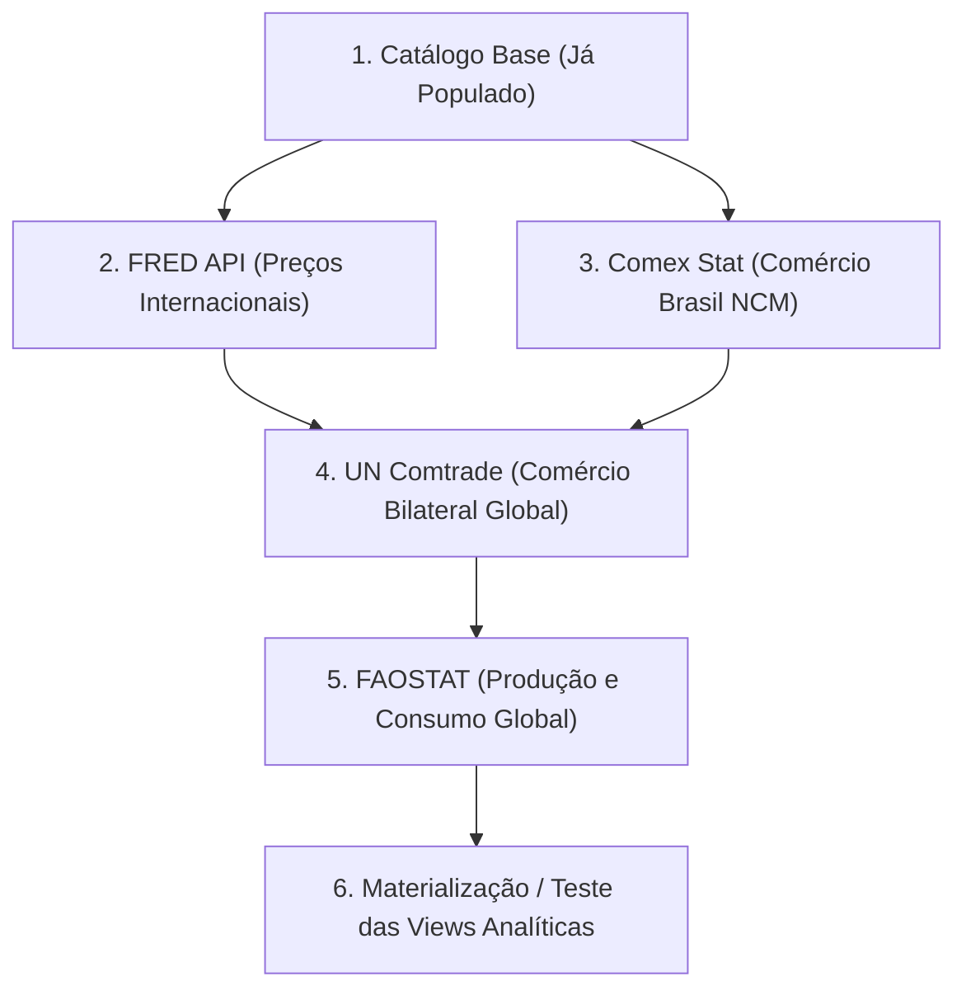

# Diretrizes e Boas Práticas de Requisições das Fontes de Dados

Este documento estabelece as especificações técnicas, cotas, limites de taxa (*rate limits*), estratégias de paginação e padrões de resiliência para os pipelines de ingestão do **FertiPartner**.

O objetivo primordial é **garantir a integridade da coleta sem estourar limites de requisição (HTTP 429/Throttling), prevenir bloqueios de IP e garantir idempotência no banco de dados em 4NF**.

---

## 1. Matriz de Limites e Especificações por Fonte

| Fonte de Dados | Autenticação | Rate Limit Oficial / Seguro | Cota Máxima Permitida | Código Throttling | Timeout Recomendado | Estratégia Principal de Coleta |
| :--- | :--- | :--- | :--- | :---: | :---: | :--- |
| **UN Comtrade (ONU)** | `Ocp-Apim-Subscription-Key` (Header) | **1 req / 2,0s** (0,5 req/s) | **500 chamadas / dia** (Free Tier); máx. 100k registros/chamada | HTTP 429 | 30s | Consultas amplas agrupadas por ano e código HS (economiza a cota diária de 500 chamadas). |
| **FRED (St. Louis Fed)** | `api_key` (Query Param) | **1 req / 1,0s** (limite oficial: 120 req/min) | Sem cota diária explícita | HTTP 429 | 15s | Consulta delta incremental usando `observation_start` a partir da última data registrada no banco. |
| **Comex Stat (MDIC - Brasil)** | Pública (sem token) | **1 req / 2,5s** | Sem limite de chamadas, mas bloqueia se consultas forem muito volumosas ou rápidas | HTTP 429 / Msg de limite | 30s | Filtragem estrita por NCM (`31021010`, etc.) em blocos anuais/mensais. Pausa de 12s se receber bloqueio temporário. |
| **FAOSTAT (ONU)** | `Bearer <JWT>` (Cognito, expira em 60m) | **1 req / 2,0s** | Protegido por Cloudflare / API Gateway; queries massivas dão timeout (504/521) | HTTP 429 / 504 / 521 | 35s | Auto-renovação de token via `FAOSTATAuthManager`. Filtragem estrita por `area`, `item` e `year` nos domínios `RFB` e `RFN`. |
| **World Bank Commodity** | Pública / REST API | **1 req / 1,5s** | Pública | HTTP 429 | 20s | Atualização periódica mensal (dados do Pink Sheet são consolidados no início de cada mês). |

---

## 2. Detalhamento por Provedor e Táticas de Engenharia

### 2.1. UN Comtrade (Comércio Bilateral Global)
* **Ponto Crítico**: A cota do plano gratuito é de **apenas 500 requisições por dia**. Se um script fizer uma requisição para cada país individualmente (190+ países), a cota se esgotará em menos de 3 execuções.
* **Boas Práticas**:
  1. **Agrupamento**: Consultar o Brasil (`reporterCode=76`) ou o grupo de países para todos os parceiros (`partnerCode=0` ou omitido) de uma só vez para o código HS de interesse (`cmdCode=310210`, `310520`, etc.). A API permite até 100.000 registros por chamada.
  2. **Rate Limiting Local**: Manter intervalo mínimo de **2 segundos** entre chamadas para evitar bloqueio por rajada (*burst rate*).
  3. **Rastreamento de Cota**: Registrar o consumo de requisições na tabela `data_collection_runs` do Supabase para interromper o pipeline com segurança caso atinja 450 requisições no mesmo dia.

### 2.2. FRED (Federal Reserve Economic Data)
* **Ponto Crítico**: O limite oficial é de **120 requisições por minuto** (2 req/s). Se estourado, retorna `HTTP 429 Too Many Requests`.
* **Boas Práticas**:
  1. **Taxa Segura**: Configurar o cliente para uma taxa máxima de **1 requisição por segundo** (60 req/min), operando com 50% de margem de segurança.
  2. **Ingestão Incremental (Delta)**: Antes de consultar uma série (ex: `PURANUSDM` para Ureia ou `DAPUSDM` para DAP), o pipeline deve consultar a tabela `price_records` no Supabase, identificar a última data (`MAX(price_date)`) e passar `observation_start=YYYY-MM-DD`. Isso reduz a carga e o tráfego de rede para poucos bytes.

### 2.3. Comex Stat (MDIC - Importações e Exportações do Brasil)
* **Ponto Crítico**: A API do MDIC é um serviço público compartilhado com o portal web. Consultas com muitos detalhes combinados simultaneamente geram a mensagem: *"Você excedeu o limite de solicitações. Por favor, tente novamente em 10 segundos"*.
* **Boas Práticas**:
  1. **Filtro Direcionado**: Nunca solicitar a base inteira via API. Filtrar diretamente pelo array de NCMs prioritários (`filters: [{ filter: 'ncm', values: ['31021010', '31052000', '31042090'] }]`).
  2. **Intervalo entre Chamadas**: Inserir uma pausa de **2 a 3 segundos** entre cada requisição POST.
  3. **Backoff Específico do MDIC**: Caso a resposta contenha o aviso de 10 segundos, o coletor deve realizar um `sleep` de **12 segundos** antes de realizar a primeira retentativa.

### 2.4. FAOSTAT (Produção e Balanço de Nutrientes)
* **Ponto Crítico**: Token de acesso JWT expira em **60 minutos** (3600 segundos). Consultas de domínios amplos sem filtro geográfico ou temporal podem disparar *Gateway Timeout* (504) ou erro Cloudflare (521).
* **Boas Práticas**:
  1. **Renovação Transparente**: Utilizar o `FAOSTATAuthManager` ([`src/app/infrastructure/faostat/auth.py`](file:///c:/Users/MICRO/Desktop/FertiPartner/src/app/infrastructure/faostat/auth.py)) que checa o `exp` do JWT sem custo de rede e auto-renova o token no endpoint `/auth/login` antes de iniciar a carga.
  2. **Fatiamento por Domínio**: Utilizar os códigos oficiais mapeados:
     * `RFB` (*Fertilizers by Product*): Produção, importação e exportação de Ureia, DAP, MAP, MOP em toneladas físicas.
     * `RFN` (*Fertilizers by Nutrient*): Consumo e produção em toneladas de nutrientes (N, P2O5, K2O).
  3. **Timeout Elevado**: Configurar `timeout=35.0` no cliente HTTP, pois o processamento interno de grandes matrizes do FAOSTAT pode levar alguns segundos.

---

## 3. Padrões de Resiliência no Pipeline de Ingestão

Para garantir que uma falha transitória de rede ou lentidão de um provedor não quebre o processo de carga nem corrompa os dados, todos os coletores devem seguir estes 4 princípios:

### 3.1. Exponential Backoff com Full Jitter
Sempre que ocorrer um erro transitório (`HTTP 429`, `500`, `502`, `503`, `504` ou `Timeout`), aplicar espera exponencial com variação aleatória (*jitter*):
$$\text{espera} = \text{random}(0, \min(T_{\max}, T_{\text{base}} \times 2^{\text{tentativa}}))$$
* **$T_{\text{base}}$**: 2 segundos.
* **$T_{\max}$**: 30 segundos (ou 15s no caso do Comex Stat).
* **Tentativas Máximas**: 3 a 5 tentativas antes de abortar o lote específico.

### 3.2. Idempotência e Upsert no Supabase
Nenhum coletor deve falhar se for executado duas vezes para o mesmo período:
* Os dados brutos são registrados na tabela `raw_data` com hash SHA-256 do payload.
* Os registros consolidados (`production_records`, `trade_records`, `price_records`) utilizam chaves compostas e `ON CONFLICT DO UPDATE` ou `DO NOTHING`, garantindo que reexecuções apenas atualizem ou ignorem dados já existentes.

### 3.3. Transparência na Tabela de Auditoria (`data_collection_runs`)
Antes de iniciar qualquer requisição externa, o pipeline registra:
1. `source_id` e `status = 'RUNNING'`;
2. Ao final de cada lote, atualiza `records_ingested` e `records_rejected`;
3. Em caso de falha irreversível, registra `status = 'FAILED'` e `error_message` detalhada para facilitar o diagnóstico.

---

## 4. Ordem Recomendada de Povoamento do Banco

Para respeitar as chaves estrangeiras e a Quarta Forma Normal (4NF) do banco, a ingestão deve ocorrer na seguinte ordem:

1. **Catálogo Base**: `fertilizers`, `countries`, `measurement_units`, `currencies`, `price_markets` (*já semeados no schema inicial*).
2. **Séries de Preços (FRED)**: Volume leve, rápido de validar e popula `price_records`.
3. **Comércio Exterior do Brasil (Comex Stat)**: Popula `trade_records` com foco em NCM de fertilizantes e aduana brasileira.
4. **Comércio Global (UN Comtrade)**: Popula os fluxos mundiais de comércio bilateral para subsidiar o Sankey e indicadores de dependência.
5. **Produção e Consumo Mundial (FAOSTAT)**: Popula `production_records` e `consumption_records`.
6. **Validação das Views**: Executar a suíte de integração para verificar o recálculo dos indicadores de market share e dependência externa brasileira.
